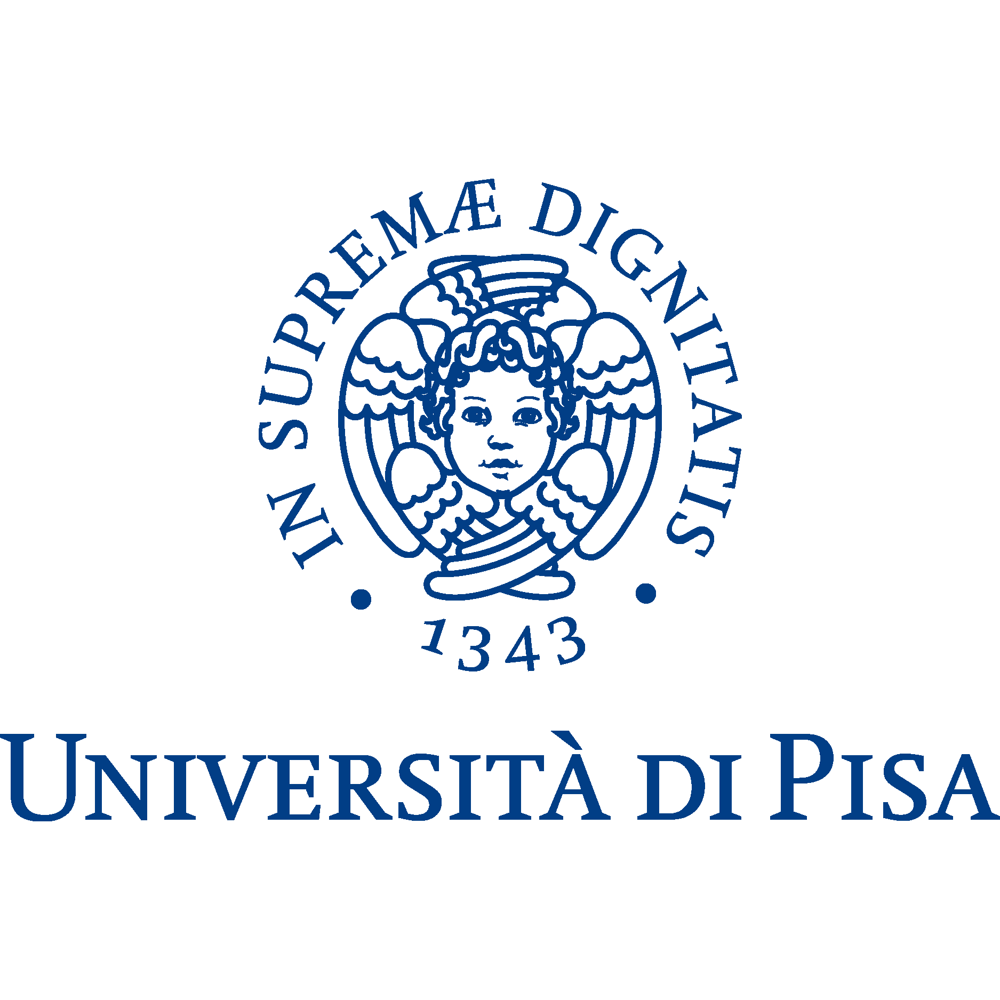
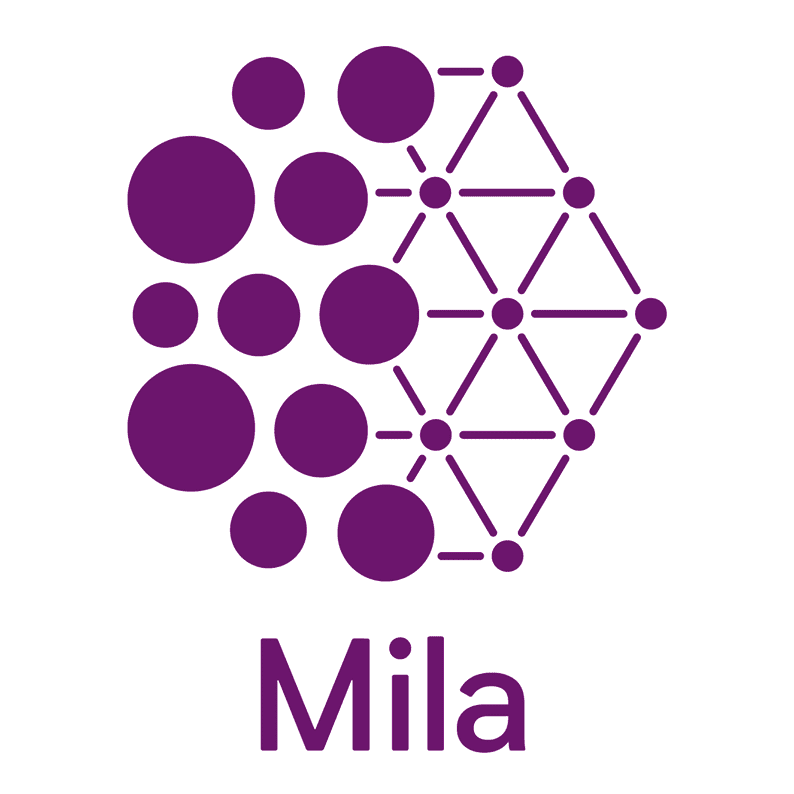
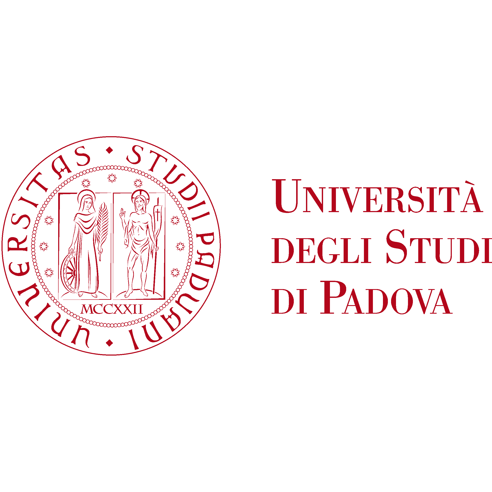

    

        
    

    

        <h1>Donald Shenaj</h1> 
        <h6><a href="https://pronoun.is/#Pronoun-Usage-and-Social-Impact) he/him." target="_blank">(he/him)</a></h6>
         
        <h4>Postdoc @ <a href="https://www.unipi.it/index.php/english" target="_blank"> University of Pisa</a></h4>
         
        <h4>Ph.D. @ <a href="https://www.unipd.it" target="_blank">University of Padova</a></h4>
        <h4>AI Research Intern @ <a href="https://research.samsung.com/sruk" target="_blank">Samsung Research UK</a>, <a href="https://mila.quebec/en" target="_blank">Mila - Quebec AI Institute </a>& <a href="https://www.concordia.ca/" target="_blank">Concordia University</a></h4>
        <h6><a href="https://github.com/donaldssh/cv/raw/master/cv.pdf" id="download_cv" download>[Download CV]</a></h6>
    

<section>
        

            

                

                    

                        
University of Pisa May 2025 - PRESENT

                        
                    

                
         
                

                    

                        
Samsung Research Oct 2024 - Apr 2025

                        
                    

                

                

                    

                        
Mila May 2023 - Nov 2023

                        
                    

                

                

                    

                        
Concordia University May 2023 - Nov 2023

                        
                    

                

                

                    

                        
University of Padova 2021 - 2025

                        
                    

                

            

        

</section>
